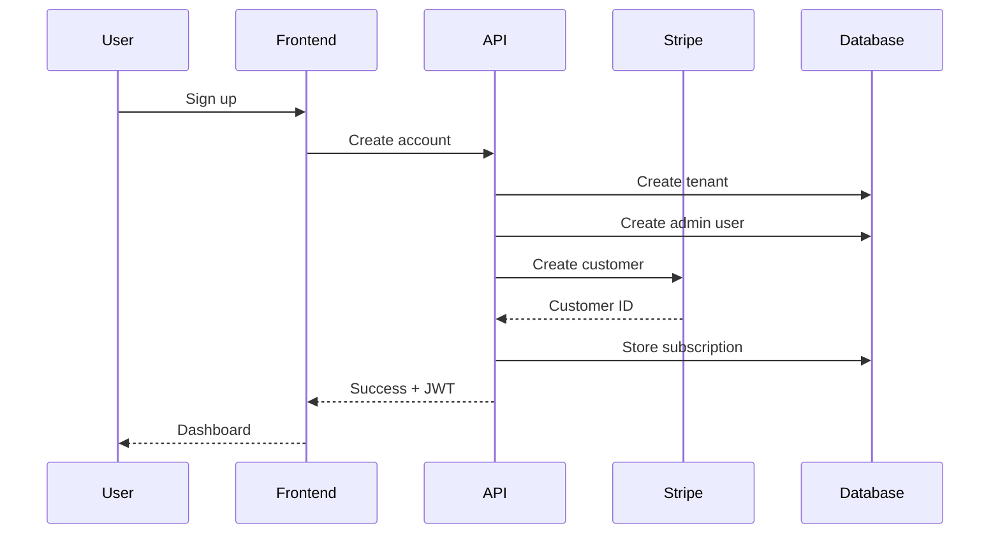

# RMAP Architecture Guide

## Table of Contents
1. [System Overview](#system-overview)
2. [Multi-Tenant Architecture](#multi-tenant-architecture)
3. [Frontend Architecture](#frontend-architecture)
4. [Backend Architecture](#backend-architecture)
5. [Database Design](#database-design)
6. [Security Architecture](#security-architecture)
7. [Scalability & Performance](#scalability--performance)
8. [Integration Patterns](#integration-patterns)

## System Overview

RMAP follows a modern microservices-oriented architecture with clear separation of concerns:

```
┌─────────────────────────────────────────────────────────────┐
│                         CDN Layer                           │
│                    (CloudFlare/CloudFront)                  │
└─────────────────────────────────────────────────────────────┘
                               │
┌─────────────────────────────────────────────────────────────┐
│                     Load Balancer                           │
│                  (ALB/Application Gateway)                  │
└─────────────────────────────────────────────────────────────┘
                               │
        ┌──────────────────────┼──────────────────────┐
        │                      │                      │
┌───────▼────────┐    ┌───────▼────────┐    ┌───────▼────────┐
│  Frontend SPA  │    │   API Gateway   │    │  WebSocket     │
│  (React/Vite)  │    │   (Hono/Node)   │    │   Server       │
└────────────────┘    └────────┬────────┘    └────────────────┘
                               │
        ┌──────────────────────┼──────────────────────┐
        │                      │                      │
┌───────▼────────┐    ┌───────▼────────┐    ┌───────▼────────┐
│   Auth Service │    │  Tenant Service │    │ Campaign Svc   │
└────────────────┘    └────────────────┘    └────────────────┘
        │                      │                      │
        └──────────────────────┼──────────────────────┘
                               │
                ┌──────────────┴──────────────┐
                │                             │
        ┌───────▼────────┐           ┌───────▼────────┐
        │   PostgreSQL   │           │     Redis      │
        │   (Primary)    │           │    (Cache)     │
        └───────┬────────┘           └────────────────┘
                │
        ┌───────▼────────┐
        │  Read Replicas │
        └────────────────┘
```

## Multi-Tenant Architecture

### Tenant Isolation Strategy

#### 1. Data Isolation
```typescript
// Row Level Security (RLS) Implementation
interface TenantScoped {
  tenantId: string;
  // ... other fields
}

// All queries automatically filtered
class TenantRepository {
  constructor(private tenantId: string) {}
  
  async find(query: Query) {
    return db.query({
      ...query,
      where: {
        ...query.where,
        tenantId: this.tenantId
      }
    });
  }
}
```

#### 2. Request Routing
```typescript
// Tenant identification middleware
export const tenantMiddleware: Middleware = async (c, next) => {
  const tenantId = 
    c.req.header('X-Tenant-ID') ||
    extractFromSubdomain(c.req.url) ||
    extractFromJWT(c.req.header('Authorization'));
    
  if (!tenantId) {
    return c.json({ error: 'Tenant not identified' }, 401);
  }
  
  c.set('tenantId', tenantId);
  await next();
};
```

#### 3. Resource Limits
```typescript
interface SubscriptionLimits {
  users: number;
  campaigns: number;
  apiCallsPerDay: number;
  storageGB: number;
  customDomains: number;
}

// Enforcement at API layer
const enforceLimit = async (resource: string, count: number) => {
  const tenant = await getTenant();
  if (count >= tenant.limits[resource]) {
    throw new LimitExceededException(resource);
  }
};
```

### Tenant Onboarding Flow



## Frontend Architecture

### Component Structure

```
src/
├── core/                 # Core utilities and types
│   ├── api/             # API client and interceptors
│   ├── auth/            # Authentication logic
│   └── types/           # TypeScript definitions
│
├── features/            # Feature modules
│   ├── campaigns/
│   │   ├── components/
│   │   ├── hooks/
│   │   ├── services/
│   │   └── types.ts
│   ├── audiences/
│   └── analytics/
│
├── shared/              # Shared components
│   ├── components/      # Reusable UI components
│   ├── hooks/          # Custom hooks
│   └── utils/          # Utility functions
│
└── workflows/          # Workflow modules
    ├── RetailMedia/
    ├── GoogleAds/
    └── MetaAds/
```

### State Management

```typescript
// Context-based state management
interface AppState {
  auth: AuthState;
  tenant: TenantState;
  ui: UIState;
}

// Auth Context
interface AuthState {
  user: User | null;
  token: string | null;
  isAuthenticated: boolean;
  permissions: Permission[];
}

// Tenant Context
interface TenantState {
  current: Tenant;
  subscription: Subscription;
  usage: UsageMetrics;
  features: Feature[];
}

// React Query for server state
const useCampaigns = () => {
  return useQuery({
    queryKey: ['campaigns', tenantId],
    queryFn: () => api.campaigns.list(),
    staleTime: 5 * 60 * 1000, // 5 minutes
  });
};
```

### Routing Strategy

```typescript
// Protected routes with role-based access
<Routes>
  <Route element={<PublicLayout />}>
    <Route path="/login" element={<Login />} />
    <Route path="/signup" element={<Signup />} />
  </Route>
  
  <Route element={<ProtectedRoute />}>
    <Route element={<DashboardLayout />}>
      <Route path="/" element={<Dashboard />} />
      <Route 
        path="/campaigns" 
        element={
          <RequirePermission permission="campaigns.read">
            <Campaigns />
          </RequirePermission>
        } 
      />
      <Route 
        path="/settings" 
        element={
          <RequireRole role={['admin', 'owner']}>
            <Settings />
          </RequireRole>
        } 
      />
    </Route>
  </Route>
</Routes>
```

## Backend Architecture

### Service Layer Pattern

```typescript
// Campaign Service Example
export class CampaignService {
  constructor(
    private repo: CampaignRepository,
    private validator: CampaignValidator,
    private events: EventBus,
    private cache: CacheService
  ) {}

  async create(data: CreateCampaignDTO, tenantId: string) {
    // Validation
    await this.validator.validate(data);
    
    // Business logic
    const campaign = await this.repo.create({
      ...data,
      tenantId,
      status: 'draft'
    });
    
    // Side effects
    await this.events.publish('campaign.created', campaign);
    await this.cache.invalidate(`campaigns:${tenantId}`);
    
    return campaign;
  }
}
```

### Middleware Stack

```typescript
// Application middleware pipeline
app.use(cors());
app.use(helmet());
app.use(compression());
app.use(requestId());
app.use(logger());
app.use(errorHandler());
app.use(authMiddleware());
app.use(tenantMiddleware());
app.use(rateLimitMiddleware());
app.use(validationMiddleware());
```

### API Versioning

```typescript
// Version management
const v1 = new Hono().basePath('/api/v1');
const v2 = new Hono().basePath('/api/v2');

// Backward compatibility
v1.get('/campaigns', legacyCampaignHandler);
v2.get('/campaigns', modernCampaignHandler);

app.route('/', v1);
app.route('/', v2);
```

## Database Design

### Schema Design Principles

```sql
-- Tenant table (master)
CREATE TABLE tenants (
  id UUID PRIMARY KEY DEFAULT gen_random_uuid(),
  name VARCHAR(255) NOT NULL,
  slug VARCHAR(100) UNIQUE NOT NULL,
  subscription_plan VARCHAR(50) NOT NULL,
  created_at TIMESTAMP DEFAULT NOW(),
  updated_at TIMESTAMP DEFAULT NOW()
);

-- Enable RLS
ALTER TABLE tenants ENABLE ROW LEVEL SECURITY;

-- All business tables include tenant_id
CREATE TABLE campaigns (
  id UUID PRIMARY KEY DEFAULT gen_random_uuid(),
  tenant_id UUID NOT NULL REFERENCES tenants(id),
  name VARCHAR(255) NOT NULL,
  status VARCHAR(50) NOT NULL,
  budget DECIMAL(10,2),
  created_at TIMESTAMP DEFAULT NOW(),
  updated_at TIMESTAMP DEFAULT NOW(),
  CONSTRAINT fk_tenant FOREIGN KEY (tenant_id) 
    REFERENCES tenants(id) ON DELETE CASCADE
);

-- Index for tenant queries
CREATE INDEX idx_campaigns_tenant ON campaigns(tenant_id);

-- RLS Policy
CREATE POLICY tenant_isolation ON campaigns
  FOR ALL
  USING (tenant_id = current_setting('app.tenant_id')::UUID);
```

### Data Partitioning Strategy

```sql
-- Partition large tables by tenant
CREATE TABLE analytics_events (
  id BIGSERIAL,
  tenant_id UUID NOT NULL,
  event_type VARCHAR(50),
  properties JSONB,
  created_at TIMESTAMP DEFAULT NOW()
) PARTITION BY HASH (tenant_id);

-- Create partitions
CREATE TABLE analytics_events_0 PARTITION OF analytics_events
  FOR VALUES WITH (modulus 4, remainder 0);
CREATE TABLE analytics_events_1 PARTITION OF analytics_events
  FOR VALUES WITH (modulus 4, remainder 1);
-- ... more partitions
```

## Security Architecture

### Authentication Flow

```typescript
// JWT-based authentication
interface JWTPayload {
  sub: string;        // user id
  tid: string;        // tenant id
  role: string;       // user role
  permissions: string[]; // explicit permissions
  exp: number;        // expiration
}

// Token generation
const generateToken = (user: User, tenant: Tenant): string => {
  return jwt.sign(
    {
      sub: user.id,
      tid: tenant.id,
      role: user.role,
      permissions: user.permissions,
      exp: Math.floor(Date.now() / 1000) + (60 * 60 * 24) // 24 hours
    },
    process.env.JWT_SECRET,
    { algorithm: 'HS256' }
  );
};
```

### Authorization Matrix

```typescript
const permissions = {
  owner: ['*'],
  admin: [
    'users.*',
    'campaigns.*',
    'settings.*',
    'billing.read'
  ],
  manager: [
    'campaigns.*',
    'audiences.*',
    'analytics.read'
  ],
  member: [
    'campaigns.read',
    'campaigns.create',
    'audiences.read'
  ],
  viewer: [
    '*.read'
  ]
};
```

### Data Encryption

```typescript
// Field-level encryption for sensitive data
class EncryptionService {
  private algorithm = 'aes-256-gcm';
  
  encrypt(text: string): EncryptedData {
    const iv = crypto.randomBytes(16);
    const cipher = crypto.createCipheriv(
      this.algorithm,
      this.key,
      iv
    );
    
    let encrypted = cipher.update(text, 'utf8', 'hex');
    encrypted += cipher.final('hex');
    
    return {
      encrypted,
      iv: iv.toString('hex'),
      tag: cipher.getAuthTag().toString('hex')
    };
  }
}
```

## Scalability & Performance

### Caching Strategy

```typescript
// Multi-layer caching
class CacheManager {
  private l1Cache = new Map(); // In-memory
  private l2Cache: Redis;       // Redis
  
  async get(key: string) {
    // Check L1
    if (this.l1Cache.has(key)) {
      return this.l1Cache.get(key);
    }
    
    // Check L2
    const value = await this.l2Cache.get(key);
    if (value) {
      this.l1Cache.set(key, value);
      return value;
    }
    
    return null;
  }
  
  async set(key: string, value: any, ttl: number) {
    this.l1Cache.set(key, value);
    await this.l2Cache.setex(key, ttl, JSON.stringify(value));
  }
}
```

### Database Optimization

```sql
-- Materialized views for analytics
CREATE MATERIALIZED VIEW campaign_performance AS
SELECT 
  c.tenant_id,
  c.id as campaign_id,
  COUNT(DISTINCT e.user_id) as unique_users,
  SUM(e.revenue) as total_revenue,
  AVG(e.revenue) as avg_revenue
FROM campaigns c
JOIN events e ON e.campaign_id = c.id
GROUP BY c.tenant_id, c.id;

-- Refresh strategy
CREATE OR REPLACE FUNCTION refresh_campaign_performance()
RETURNS void AS $$
BEGIN
  REFRESH MATERIALIZED VIEW CONCURRENTLY campaign_performance;
END;
$$ LANGUAGE plpgsql;

-- Schedule refresh
SELECT cron.schedule('refresh-performance', '*/15 * * * *', 
  'SELECT refresh_campaign_performance()');
```

### Load Balancing

```nginx
upstream api_servers {
  least_conn;
  server api1.rmap.io:4000 weight=3;
  server api2.rmap.io:4000 weight=3;
  server api3.rmap.io:4000 weight=2;
  
  # Health checks
  check interval=3000 rise=2 fall=5 timeout=1000;
}

server {
  location /api {
    proxy_pass http://api_servers;
    proxy_set_header X-Real-IP $remote_addr;
    proxy_set_header X-Tenant-ID $http_x_tenant_id;
  }
}
```

## Integration Patterns

### External API Integration

```typescript
// Abstract integration interface
interface PlatformIntegration {
  connect(credentials: Credentials): Promise<void>;
  disconnect(): Promise<void>;
  syncCampaigns(): Promise<Campaign[]>;
  createCampaign(data: CampaignData): Promise<string>;
  updateCampaign(id: string, data: Partial<CampaignData>): Promise<void>;
}

// Google Ads implementation
class GoogleAdsIntegration implements PlatformIntegration {
  private client: GoogleAdsClient;
  
  async connect(credentials: GoogleCredentials) {
    this.client = new GoogleAdsClient({
      client_id: credentials.clientId,
      client_secret: credentials.clientSecret,
      refresh_token: credentials.refreshToken
    });
  }
  
  async syncCampaigns() {
    const campaigns = await this.client.campaigns.list();
    return campaigns.map(this.transformCampaign);
  }
  
  private transformCampaign(googleCampaign: any): Campaign {
    // Transform Google's format to our internal format
    return {
      id: googleCampaign.id,
      name: googleCampaign.name,
      status: this.mapStatus(googleCampaign.status),
      budget: googleCampaign.budget.amountMicros / 1000000,
      // ... more mapping
    };
  }
}
```

### Event-Driven Architecture

```typescript
// Event bus for decoupled communication
class EventBus {
  private handlers: Map<string, EventHandler[]> = new Map();
  
  subscribe(event: string, handler: EventHandler) {
    if (!this.handlers.has(event)) {
      this.handlers.set(event, []);
    }
    this.handlers.get(event)!.push(handler);
  }
  
  async publish(event: string, data: any) {
    const handlers = this.handlers.get(event) || [];
    
    // Execute handlers in parallel
    await Promise.all(
      handlers.map(handler => 
        handler(data).catch(console.error)
      )
    );
  }
}

// Usage
eventBus.subscribe('campaign.created', async (campaign) => {
  await notificationService.notify(campaign.createdBy, 
    `Campaign ${campaign.name} created`);
  await analyticsService.track('campaign_created', campaign);
  await billingService.updateUsage(campaign.tenantId, 'campaigns', 1);
});
```

### Webhook System

```typescript
// Webhook delivery with retry logic
class WebhookService {
  async deliver(webhook: Webhook, event: Event) {
    const payload = {
      id: event.id,
      type: event.type,
      data: event.data,
      timestamp: event.timestamp,
      signature: this.generateSignature(event)
    };
    
    const config = {
      maxRetries: 5,
      retryDelay: 1000,
      timeout: 10000
    };
    
    return this.sendWithRetry(webhook.url, payload, config);
  }
  
  private async sendWithRetry(url: string, payload: any, config: RetryConfig) {
    for (let i = 0; i < config.maxRetries; i++) {
      try {
        const response = await fetch(url, {
          method: 'POST',
          headers: {
            'Content-Type': 'application/json',
            'X-RMAP-Signature': payload.signature
          },
          body: JSON.stringify(payload),
          signal: AbortSignal.timeout(config.timeout)
        });
        
        if (response.ok) return response;
        
        // Exponential backoff
        await sleep(config.retryDelay * Math.pow(2, i));
      } catch (error) {
        if (i === config.maxRetries - 1) throw error;
      }
    }
  }
}
```

## Monitoring & Observability

### Metrics Collection

```typescript
// Prometheus metrics
import { Counter, Histogram, Gauge } from 'prom-client';

const httpRequestDuration = new Histogram({
  name: 'http_request_duration_seconds',
  help: 'Duration of HTTP requests in seconds',
  labelNames: ['method', 'route', 'status', 'tenant']
});

const activeConnections = new Gauge({
  name: 'active_connections',
  help: 'Number of active connections',
  labelNames: ['tenant']
});

const apiCallsCounter = new Counter({
  name: 'api_calls_total',
  help: 'Total number of API calls',
  labelNames: ['tenant', 'endpoint', 'status']
});
```

### Distributed Tracing

```typescript
// OpenTelemetry setup
import { trace, context } from '@opentelemetry/api';

const tracer = trace.getTracer('rmap-api');

export const tracedHandler = (handler: Handler) => {
  return async (c: Context) => {
    const span = tracer.startSpan(`${c.req.method} ${c.req.path}`);
    
    return context.with(trace.setSpan(context.active(), span), async () => {
      try {
        span.setAttributes({
          'http.method': c.req.method,
          'http.url': c.req.url,
          'tenant.id': c.get('tenantId')
        });
        
        const result = await handler(c);
        
        span.setStatus({ code: SpanStatusCode.OK });
        return result;
      } catch (error) {
        span.recordException(error);
        span.setStatus({ code: SpanStatusCode.ERROR });
        throw error;
      } finally {
        span.end();
      }
    });
  };
};
```

## Deployment Architecture

### Container Strategy

```dockerfile
# Multi-stage build
FROM node:20-alpine AS builder
WORKDIR /app
COPY package*.json ./
RUN npm ci --only=production

FROM node:20-alpine
WORKDIR /app
COPY --from=builder /app/node_modules ./node_modules
COPY . .
EXPOSE 4000
CMD ["node", "dist/index.js"]
```

### Kubernetes Deployment

```yaml
apiVersion: apps/v1
kind: Deployment
metadata:
  name: rmap-api
spec:
  replicas: 3
  strategy:
    type: RollingUpdate
    rollingUpdate:
      maxSurge: 1
      maxUnavailable: 0
  selector:
    matchLabels:
      app: rmap-api
  template:
    metadata:
      labels:
        app: rmap-api
    spec:
      containers:
      - name: api
        image: rmap/api:latest
        ports:
        - containerPort: 4000
        env:
        - name: DATABASE_URL
          valueFrom:
            secretKeyRef:
              name: rmap-secrets
              key: database-url
        resources:
          requests:
            memory: "256Mi"
            cpu: "250m"
          limits:
            memory: "512Mi"
            cpu: "500m"
        livenessProbe:
          httpGet:
            path: /health
            port: 4000
          initialDelaySeconds: 30
          periodSeconds: 10
        readinessProbe:
          httpGet:
            path: /ready
            port: 4000
          initialDelaySeconds: 5
          periodSeconds: 5
```

## Disaster Recovery

### Backup Strategy

```bash
# Automated PostgreSQL backup
#!/bin/bash
TIMESTAMP=$(date +%Y%m%d_%H%M%S)
BACKUP_FILE="rmap_backup_${TIMESTAMP}.sql"

# Backup database
pg_dump $DATABASE_URL > $BACKUP_FILE

# Encrypt backup
gpg --encrypt --recipient backup@rmap.io $BACKUP_FILE

# Upload to S3
aws s3 cp ${BACKUP_FILE}.gpg s3://rmap-backups/postgres/

# Cleanup
rm $BACKUP_FILE ${BACKUP_FILE}.gpg
```

### Failover Process

```typescript
// Health check and failover
class HealthMonitor {
  private primary: Database;
  private replica: Database;
  private isFailedOver = false;
  
  async checkHealth() {
    try {
      await this.primary.ping();
      if (this.isFailedOver) {
        await this.failback();
      }
    } catch (error) {
      if (!this.isFailedOver) {
        await this.failover();
      }
    }
  }
  
  private async failover() {
    console.error('Primary database failed, failing over to replica');
    this.isFailedOver = true;
    // Update connection pool to use replica
    connectionPool.updateConfig({
      host: process.env.REPLICA_HOST
    });
    // Notify ops team
    await alertService.critical('Database failover initiated');
  }
}
```

## Performance Benchmarks

### Load Testing Results

```yaml
# K6 load test configuration
scenarios:
  constant_load:
    executor: 'constant-arrival-rate'
    rate: 1000
    timeUnit: '1s'
    duration: '10m'
    preAllocatedVUs: 100
    
# Results
metrics:
  http_req_duration:
    p95: 87ms
    p99: 124ms
  http_req_failed:
    rate: 0.01%
  iterations:
    count: 600000
```

### Optimization Techniques

1. **Query Optimization**
   - Use prepared statements
   - Implement query result caching
   - Add appropriate indexes
   - Use connection pooling

2. **API Optimization**
   - Response compression (gzip/brotli)
   - HTTP/2 support
   - CDN for static assets
   - Edge caching for common queries

3. **Frontend Optimization**
   - Code splitting
   - Lazy loading
   - Tree shaking
   - Asset optimization

## Conclusion

This architecture provides:
- **Scalability**: Horizontal scaling at all layers
- **Security**: Multiple layers of protection
- **Performance**: Sub-100ms API response times
- **Reliability**: 99.99% uptime SLA capability
- **Maintainability**: Clear separation of concerns

For implementation details, see the [Developer Setup Guide](./DEVELOPER_SETUP.md).