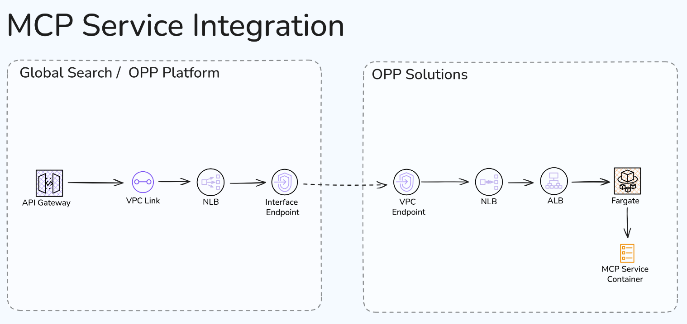

# Statista MCP Server

Model Context Protocol server providing access to Statista's statistical data and charts.

## Using the MCP Server

### Endpoints

- **Health Check**: `GET /health` - Server status and active sessions
- **MCP**: `POST /mcp` - Main MCP endpoint for tool interactions

### Authorization

All requests require Statista API key:

```
Authorization: Bearer <STATISTA_API_KEY>
```

### Tools

- `search-statistics` - Search Statista's data catalogue
- `get-chart-data-by-id` - Retrieve detailed chart data by ID

## Running Locally

### Using npm

```bash
npm install
npm run build
npm start
```

### Using Docker Compose

```bash
docker-compose up
```

Server runs on port 3000 by default.

## Deployment to AWS

Prerequisites, follow the guides:

- [AWS cli](https://docs.aws.amazon.com/cli/latest/userguide/install-cliv2.html)
- [CDK cli](https://docs.aws.amazon.com/cdk/v2/guide/cli.html)

To setup profiles for the different AWS accounts, use `aws configure sso`. Deployment by hand
is mainly done in DEV, but it does not hurt to have access to STAGE and PROD too.

The SSO setup will ask for input, like

- start URL: https://statista.awsapps.com/start/#
- default region: eu-central-1

The examples assume the existence of an `dev` profile for the DEV environment. Replace with the
name chosen during setup.

The examples assume an open shell in the working directory `cdk/`.

### Login to an account/profile

Before interacting with an AWS account, login first:

```
aws --profile dev sso login
```

### Build the code

To fetch the latest information, and build the CDK typescript code for all environments, run

```
cdk synth
```

### Difference to the deployed state

To inspect the difference between the local code and the deployed infrastructure the
`diff` command can help. Here it is needed to specify the env and stack.
In this exampple the env is 'DEV' and we want to see the diff for the stacks matching the
pattern 'MCP\*'. For STAGE it would be '"STAGE/MCP\*"'.

```
cdk --profile dev diff "DEV/MCP*"
```

### Deploy to environment

Similar to the difference, an actual deployment needs the profile and stack is input.

```
cdk --profile dev deploy "DEV/MCP*"
```

## AWS infrastructure and API integration

The MCP service is accessible for consumers via the API Gateway, owned by the API Solutions Team, which
currently is deployed to the global-search accounts, but will be moved to the opp-platform accounts in the future.

The MCP Server code is dockerized and running as a task in a Fargate cluster behind an application load-balancer (ALB).
Choosing an ALB over a network load-balancer (NLB) is due the potential need of sticky sessions in the future.
The service task is running in private VPC subnets and no direct internet access is possible. The ALB access is protected with
a custom key and secret, which must be provided as a HTTP header. This is the recommended zero trust setup.
The global-search accounts have permission to access key and secrets, adding the header automatically to calls to the Fargate
service.

The API gateway can not access the service directly via the available transit gateway. The recommended way of integrating
services in other accounts, running in private subnets, is to add a VpcLink for the RestAPI resource. The VpcLink
routes HTTP(s) requests via a NLB to a VPC Interface Endpoint.
The corresponding part on opp-solutions side is a VPC endpoint. VPC endpoints can not route network traffic directly
to an ALB. An intermediate NLB is needed.

The complete diagram looks like this


Editable version of the [Excalidraw diagram](https://excalidraw.com/#json=bR766RmgsTW54xCVRI0Tl,wcdsGesyggXmuI1Xb9W2QA).
